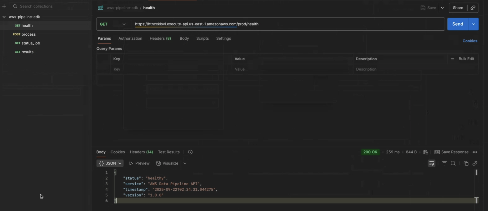
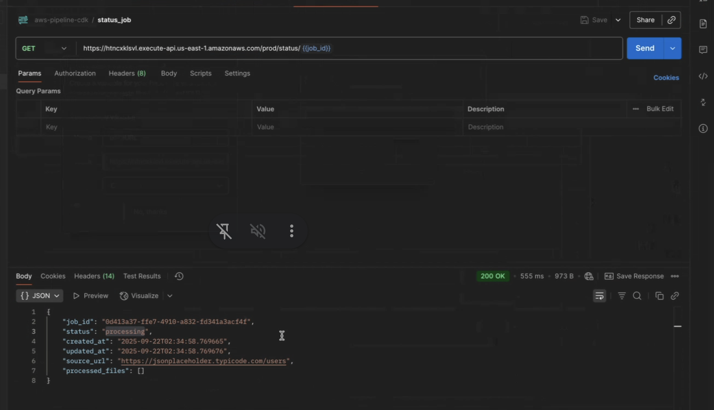
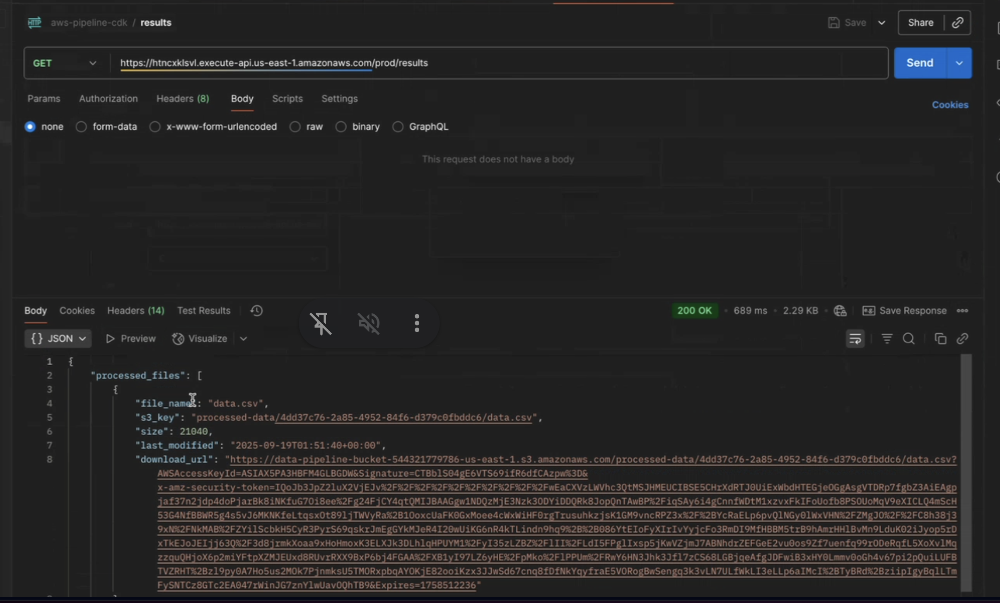

# AWS Data Pipeline CDK

A serverless data pipeline built with AWS CDK that extracts data from external APIs, processes it, and makes it available for analytics through AWS services.

## 🏗️ Architecture

This project implements a complete data pipeline using:

- **AWS Lambda**: Data extraction, processing, and API endpoints
- **Amazon S3**: Data lake storage (JSON and CSV formats)
- **AWS Glue**: Data cataloging and ETL
- **Amazon Athena**: SQL queries and analytics
- **AWS Lake Formation**: Data governance and security
- **Amazon DynamoDB**: Job tracking and status management
- **Amazon API Gateway**: REST API for testing and integration
- **AWS CDK**: Infrastructure as Code

## 🚀 Features

- ✅ Serverless architecture
- ✅ Automated data extraction from REST APIs
- ✅ Dual format storage (JSON + CSV)
- ✅ Data cataloging with AWS Glue
- ✅ SQL analytics with Amazon Athena
- ✅ Security with Lake Formation
- ✅ Infrastructure as Code with CDK
- ✅ CI/CD pipeline with GitHub Actions
- ✅ Comprehensive testing
- ✅ **REST API endpoints for easy testing**
- ✅ **Postman collection for API testing**
- ✅ **Job tracking with DynamoDB**

## 📋 Prerequisites

- **Node.js** 18+ and npm
- **Python** 3.10+
- **AWS CLI** configured with appropriate credentials
- **AWS CDK** CLI (`npm install -g aws-cdk`)

## 🛠️ Installation

1. **Clone the repository**
   ```bash
   git clone https://github.com/your-username/aws-data-pipeline-cdk.git
   cd aws-data-pipeline-cdk
   ```

2. **Install dependencies**
   ```bash
   # Python dependencies
   pip install -r requirements.txt
   
   # CDK dependencies
   npm install
   ```

3. **Bootstrap CDK** (first time only)
   ```bash
   cdk bootstrap
   ```

## 🚀 Deployment

### Quick Deployment
```bash
python deploy.py
```

### Manual Deployment
```bash
# Synthesize CloudFormation template
cdk synth

# Deploy infrastructure
cdk deploy --require-approval never
```

## 🧪 Testing

### Unit Tests
Run the test suite:
```bash
python test_lambda.py
```

### API Testing with Postman

The project includes REST API endpoints for easy testing and integration. After deployment, you can test the pipeline using Postman or any HTTP client.

#### 🔗 Available Endpoints

| Method | Endpoint | Description |
|--------|----------|-------------|
| `GET` | `/health` | Health check endpoint |
| `POST` | `/process` | Trigger data processing from URL |
| `GET` | `/status/{job_id}` | Check processing job status |
| `GET` | `/results` | Get all processed files and statistics |

#### 📦 Postman Setup

1. **Import Collection**: Import `postman/AWS_Data_Pipeline_API.postman_collection.json`
2. **Import Environment**: Import `postman/environment.postman_environment.json`
3. **Update Base URL**: After deployment, update the `base_url` variable with your API Gateway URL

#### 🚀 Quick Test Flow

1. **Health Check**
   ```bash
   GET {{base_url}}/health
   ```

2. **Process Data**
   ```bash
   POST {{base_url}}/process
   Content-Type: application/json
   
   {
     "url": "https://jsonplaceholder.typicode.com/users"
   }
   ```

3. **Check Status**
   ```bash
   GET {{base_url}}/status/{{job_id}}
   ```

4. **Get Results**
   ```bash
   GET {{base_url}}/results
   ```

#### 📋 Example Requests

**Process JSONPlaceholder Users:**
```json
{
  "url": "https://jsonplaceholder.typicode.com/users"
}
```

**Process JSONPlaceholder Posts:**
```json
{
  "url": "https://jsonplaceholder.typicode.com/posts"
}
```

#### 🔍 Response Examples

**Process Response (202 Accepted):**
```json
{
  "job_id": "12345678-1234-1234-1234-123456789012",
  "status": "processing",
  "message": "Data processing started",
  "created_at": "2024-01-01T12:00:00Z"
}
```

**Status Response (200 OK):**
```json
{
  "job_id": "12345678-1234-1234-1234-123456789012",
  "status": "completed",
  "created_at": "2024-01-01T12:00:00Z",
  "completed_at": "2024-01-01T12:01:30Z",
  "s3_key": "processed-data/users_20240101_120000.json"
}
```

**Results Response (200 OK):**
```json
{
  "total_files": 5,
  "processed_files": [
    {
      "filename": "users_20240101_120000.json",
      "s3_key": "processed-data/users_20240101_120000.json",
      "size": 2048,
      "created_at": "2024-01-01T12:01:30Z"
    }
  ],
  "statistics": {
    "total_records": 10,
    "processing_time": "90 seconds"
  }
}
```

#### 📸 API Testing Screenshots

Below are real examples of the API endpoints in action using Postman:

**Health Check Endpoint:**


**Process Data Endpoint:**


**Job Status Endpoint:**


**Results Endpoint:**


## 📊 Usage

### 1. Trigger Data Pipeline
```bash
# Invoke Lambda function
aws lambda invoke \
  --function-name DataPipelineLambda \
  --payload '{}' \
  response.json
```

### 2. Run Glue Crawler
```bash
aws glue start-crawler --name data-pipeline-crawler
```

### 3. Query Data with Athena
```sql
-- Switch to the data pipeline workgroup
USE data_pipeline_db;

-- Query user data
SELECT * FROM users LIMIT 10;

-- Analyze data by city
SELECT 
  address_city,
  COUNT(*) as user_count
FROM users 
GROUP BY address_city 
ORDER BY user_count DESC;
```

## 🏗️ Project Structure

```
aws-data-pipeline-cdk/
├── lambda/                     # Lambda function code
│   ├── lambda_function.py     # Main Lambda handler
│   └── api_handler.py         # API Lambda handler
├── aws_data_pipeline_cdk/     # CDK infrastructure code
│   ├── __init__.py
│   └── data_pipeline_stack.py # CDK stack definition
├── postman/                   # API testing files
│   ├── AWS_Data_Pipeline_API.postman_collection.json
│   └── environment.postman_environment.json
├── .github/workflows/         # CI/CD pipelines
│   └── ci.yml                # GitHub Actions workflow
├── tests/                     # Test files
├── cdk.json                  # CDK configuration
├── requirements.txt          # Python dependencies
├── package.json             # Node.js dependencies
├── deploy.py               # Deployment script
├── test_lambda.py         # Test suite
└── README.md             # This file
```

## 🔧 Configuration

### Environment Variables
The Lambda function uses these environment variables:
- `BUCKET_NAME`: S3 bucket for data storage
- `API_URL`: External API endpoint (default: JSONPlaceholder)

### CDK Context
Configure deployment context in `cdk.json`:
```json
{
  "context": {
    "environment": "dev",
    "region": "us-east-1"
  }
}
```

## 🔒 Security

- ✅ No hardcoded credentials
- ✅ IAM roles with least privilege
- ✅ Lake Formation data governance
- ✅ Encrypted S3 storage
- ✅ VPC endpoints for private communication

## 📈 Monitoring

The pipeline includes:
- CloudWatch logs for Lambda execution
- CloudWatch metrics for performance monitoring
- Error handling and retry logic
- Structured logging for debugging

## 🔄 CI/CD Pipeline

GitHub Actions workflow includes:
- **Testing**: Unit tests and linting
- **Security**: Code scanning with Bandit
- **Deployment**: Automated deployment to staging/production
- **Validation**: Post-deployment testing

## 🤝 Contributing

1. Fork the repository
2. Create a feature branch (`git checkout -b feature/amazing-feature`)
3. Commit your changes (`git commit -m 'Add amazing feature'`)
4. Push to the branch (`git push origin feature/amazing-feature`)
5. Open a Pull Request

## 📝 License

This project is licensed under the MIT License - see the [LICENSE](LICENSE) file for details.

## 🆘 Troubleshooting

### Common Issues

**CDK Bootstrap Error**
```bash
# Re-run bootstrap with explicit region
cdk bootstrap aws://ACCOUNT-NUMBER/REGION
```

**Lambda Timeout**
- Increase timeout in `data_pipeline_stack.py`
- Check CloudWatch logs for performance issues

**Glue Crawler Fails**
- Verify S3 bucket permissions
- Check data format consistency

**Athena Query Errors**
- Ensure Glue crawler completed successfully
- Verify workgroup configuration

## 📞 Support

For support and questions:
- Create an issue in this repository
- Check the [AWS CDK documentation](https://docs.aws.amazon.com/cdk/)
- Review [AWS Lambda best practices](https://docs.aws.amazon.com/lambda/latest/dg/best-practices.html)

## Limpieza

```bash
cdk destroy --force
```

## 🏷️ Tags

`aws` `cdk` `lambda` `s3` `glue` `athena` `data-pipeline` `serverless` `python` `infrastructure-as-code`